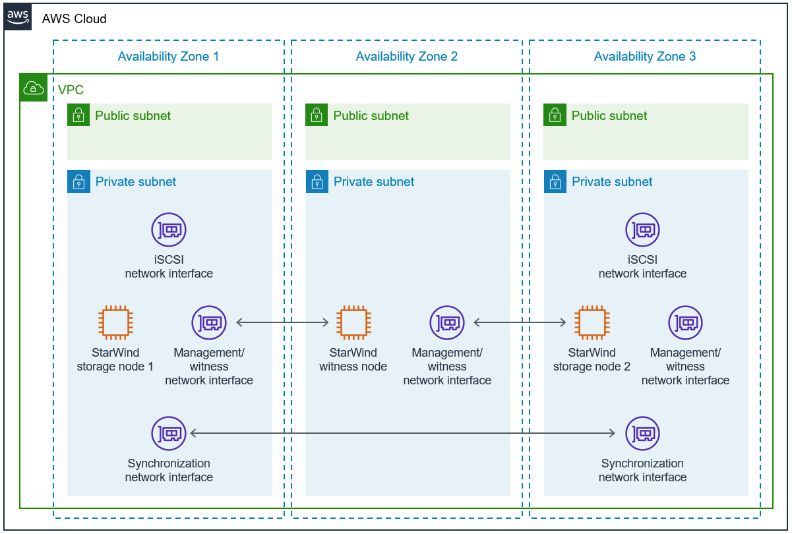

:xrefstyle: short

Deploying this Quick Start for a new virtual private cloud (VPC) with
default parameters builds the following {partner-product-short-name} environment in the
AWS Cloud.

// Replace this example diagram with your own. Follow our wiki guidelines: https://w.amazon.com/bin/view/AWS_Quick_Starts/Process_for_PSAs/#HPrepareyourarchitecturediagram. Upload your source PowerPoint file to the GitHub {deployment name}/docs/images/ directory in this repo.

[#architecture1]
.Quick Start architecture for {partner-product-short-name} on AWS

As shown in <<architecture1>>, the Quick Start sets up the following:

* A highly available architecture that spans three Availability Zones.
* A VPC configured with public and private subnets, according to AWS
best practices, to provide you with your own virtual network on AWS.*
* In the public subnets:
** Managed network address translation (NAT) gateways to allow outbound
internet access for resources in the private subnets.*
** A Windows bastion host in an Auto Scaling group to allow inbound Secure
Remote Desktop (RDP) access to EC2 instances in public and private subnets.*
* In the private subnets:
** Two StarWind VSAN EC2 storage instances (nodes 1 and 2) in Availability Zones 1 and 3. These storage instances are clustered in a Windows Server Failover Cluster and comprise the VSAN. 
** A StarWind VSAN EC2 witness instance in Availability Zone 2. This witness instance monitors the cluster in order to ensure failover takes place in case of a failure. 
** Two iSCSI elastic network interfaces in Availability Zones 1 and 3. These network interfaces allow storage clients to access the VSAN storage.
** Three management/witness network interfaces in Availability Zones 1, 2, and 3, which allow administrators management access to the cluster.
** Two synchronization network interfaces in Availability Zones 1 and 3. These network interfaces are used to replicate the storage on the StarWind VSAN cluster.

//TODO Dave, In the diagram, only two of the management/witness network interfaces have arrows. What about the third one ... is an arrow maybe implied between it and storage node 1?
// I think it's implied, and adding additional arrows would make the diagram messy.

//TODO Dave, In the bullet points above, please fill in the blanks.

[.small]#* The template that deploys the Quick Start into an existing VPC skips the components marked by asterisks and prompts you for your existing VPC configuration.#
